# Compactyl - A Compact Dactyl ManuForm Keyboard

This is a fork of the [okke fork](https://github.com/okke-formsma/dactyl-manuform-tight) of the [l4u fork](https://github.com/l4u/dactyl-manuform-mini-keyboard) of the [tshort fork](https://github.com/tshort/dactyl-keyboard) of the [Dactyl](https://github.com/adereth/dactyl-keyboard), a parameterized, split-hand, concave, columnar, ergonomic keyboard.

## Planned V5.0 Features
- Add fourth thumb keys
- Update USB holder for bastardkb pcb mcu holder v1.4 (TODO may fit blackpill version as well)
- Rotate and adjust lower two keys further away along Y and Z to make compatible with taller keycap profiles on alpha
- Adjust key heights to return to some of the design ideas I was trying out with [the dactyl hobbitform](https://github.com/dereknheiley/ibnuda.dactyl-keyboard) for small hands
	- Adjust column heights, ring finger lower on Z, middle and index columns higher on Z
	- Increase curvature of pinky column to bring bottom alpha and num row closer to finger
	- Raise numrow slightly along Z axis
- TODO add ready to print risers with slots to increase palm rest height
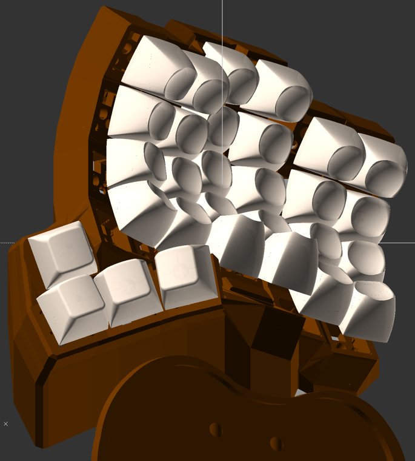

## V4.1 Features
- Added diode holder under switch for kailh hotswap socket. Holds the diode in an secure way so you can bend the wires around for easier soldering. Inspired by [Stingray](https://github.com/stingray127/handwirehotswap), [50an6xy06r6n](https://github.com/50an6xy06r6n/hotswap_pcb_generator) and [rmtz](https://www.reddit.com/r/MechanicalKeyboards/comments/7ueojw/my_na%C3%AFve_attempt_at_making_my_own_keyboard/) solderless sockets.
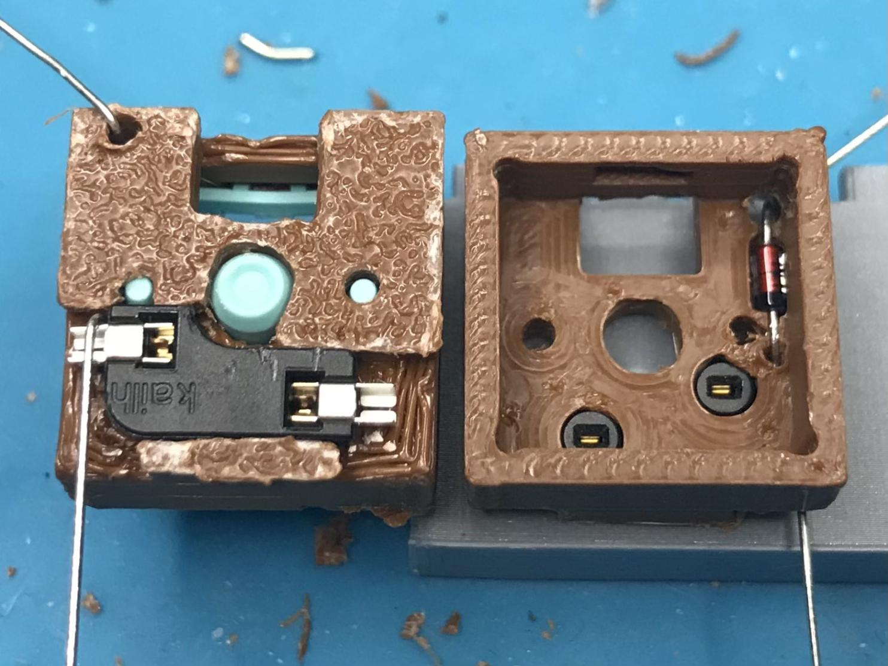

## V4.0 Features
- Cleaned up threaded insert holes for two-part case
- Raised thumb cluster and adjusted thumb cluster angle
- Added [DES "MT4"](https://github.com/dereknheiley/PseudoMakeMeKeyCapProfiles) rendered keycap preview with per-row profile and custom outer column keycaps
- Adjust tolerances around usb-holder to slide in more easily
- Lengthen USB holder for 35mm pro-micro-usb-c controllers
- Add more room for TRRS jack in USB holder
- Make vertical USB-holder easier to print with thicker "bottom"
- NOTE: you will probably have to increase OpenSCAD params:
	- Turn off rendering at ~10,000,000 
	- CGAL cache size ~8000mb
	- PolySet cache size ~8000mb
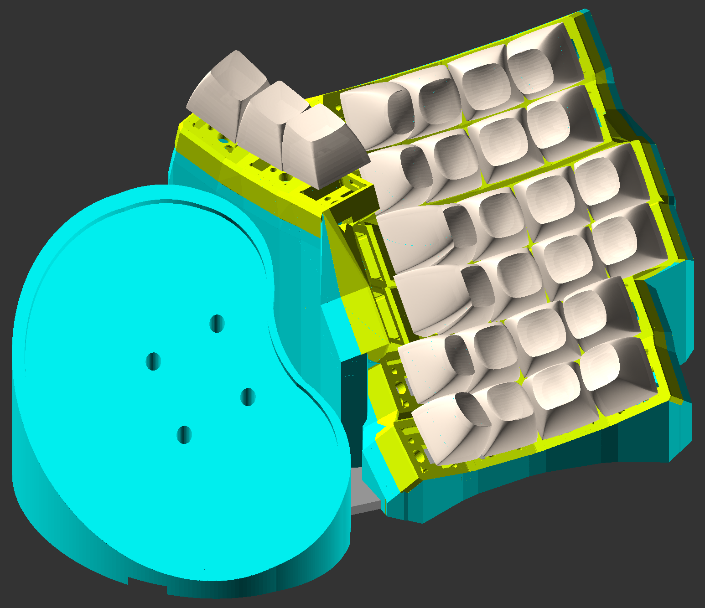
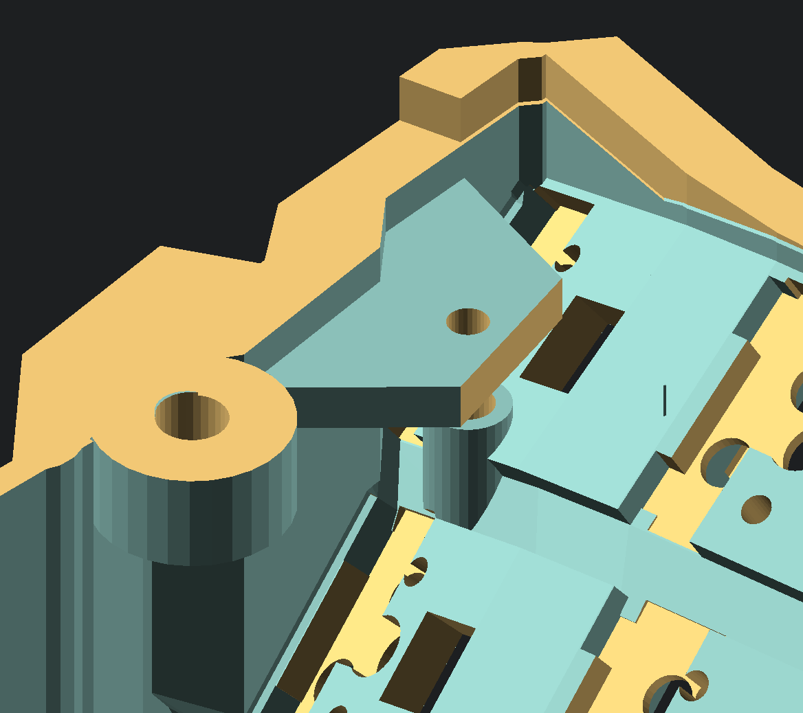

## V3.1 Features
- Added support for tilting outer index and pinky columns only
- Increased tent angle to 40 deg
- Adjusted case to remove jank around top index corner
- Changed to use vertical MCU holder
- Upsized top plate attachment screws from M2 to M3
- Modified case walls connecting to thumb
- Updated rendered thumb caps to rotated SA R1, which I use.
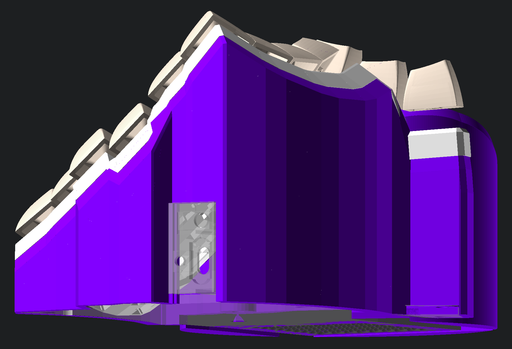

## V3.0 Features
- Added option for two part design per keyboard half
- Made a [watermelon keyboard](https://imgur.com/gallery/GW7DmTZ)

<!--  -->

## V2.1 Features
- Increased tent angle
	- Added global thumb angle adjustment
	- Adjusted case to still accommodate usb-holder with increased tent
- Reworked gel wrist rest holder to not distort at higher tenting angles
- Reinforced connection between columns with cutouts for connector / wiring clearance
- Added option to increase angle of lower two lower keys (inspired by rmtz Naive design)
- Added rendered option for keycap preview
- (Experimental) Added optional retention clip to assist with one-piece flexible PCB
- (Experimental) Added optional solderless socket option. Inspired by [Stingray](https://github.com/stingray127/handwirehotswap), [50an6xy06r6n](https://github.com/50an6xy06r6n/hotswap_pcb_generator) and [rmtz](https://www.reddit.com/r/MechanicalKeyboards/comments/7ueojw/my_na%C3%AFve_attempt_at_making_my_own_keyboard/) solderless sockets.
- NOTE: you will probably have to increase OpenSCAD params:
	- Turn off rendering at ~2,000,000 
	- CGAL cache size ~4000mb
	- PolySet cache size ~4000mb
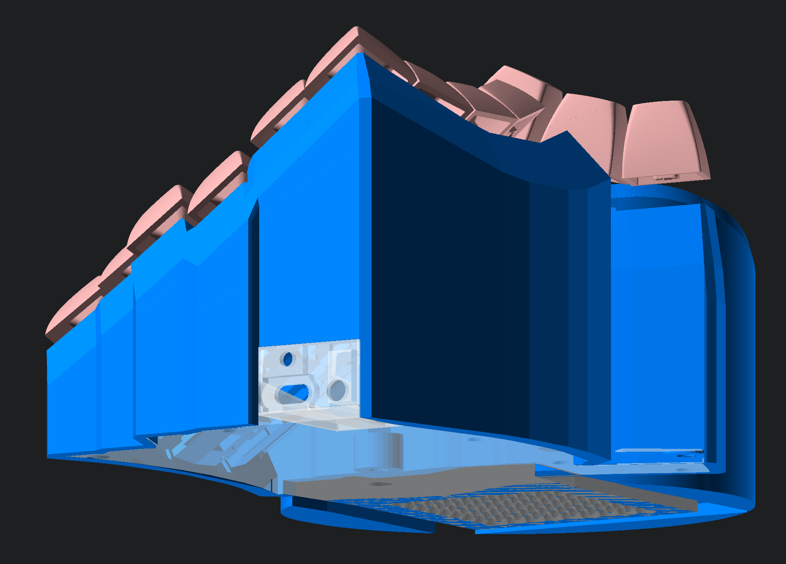

## V2.0 Features
- Returned back to one solid piece top case deisgn for easier printing
- Subtraced space around keycaps to improve clearances
	- better clearance on top row for middle and ring finger keys
	- thick ABS caps still not recommended
- Adjusted stagger and column height deltas
- Extended bottom plate to connect wrist rest
	- Wrist rest can be positioned to adjust X, Y, or Z placement (adding or removing shims)
- Added modified version of cyrstalhands wrist rest holder
	- slanted, removed case connector tubes, added threaded insert holes

## V1.0 Features
- Hotswap north facing switch plates
- Increase pinky stagger
- Adjusted column spacing for better clearance
- Continuous (vs. recessed) bottom plate with filleted holes
- Exoskeleton top case design
- Rendered both 4x6 and 5x6 versions with bottom plate
- (orig. Tightyl) As small around the keys as possible
- (orig. Tightyl) Smoother transition between thumb and fingers (less facets)
- (orig. Tightyl) Thicker walls in steep regions where walls were too thin

[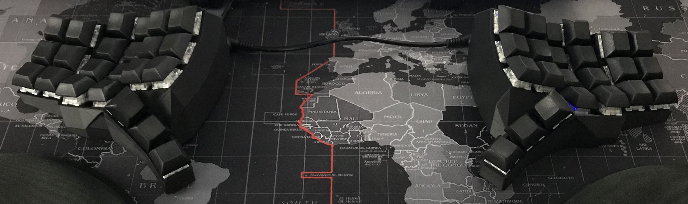](https://www.youtube.com/watch?v=2oHvrcsFb9k)

## Update USB holder
- Created ("working" but unpolished) SCAD version of USB holder for modifications
- Provide better clearance to USB cables plugging into controller
- Adjust size to better hold Elite-C controller
- Taper angle to reduce waste material
- Make holder shape symetrical to case notches so it fits upside down or right side up
- Add option for square reset button to be held as well

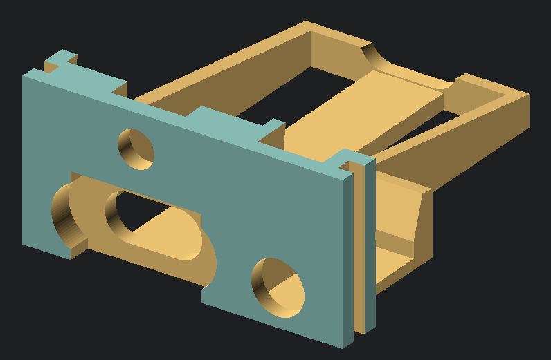
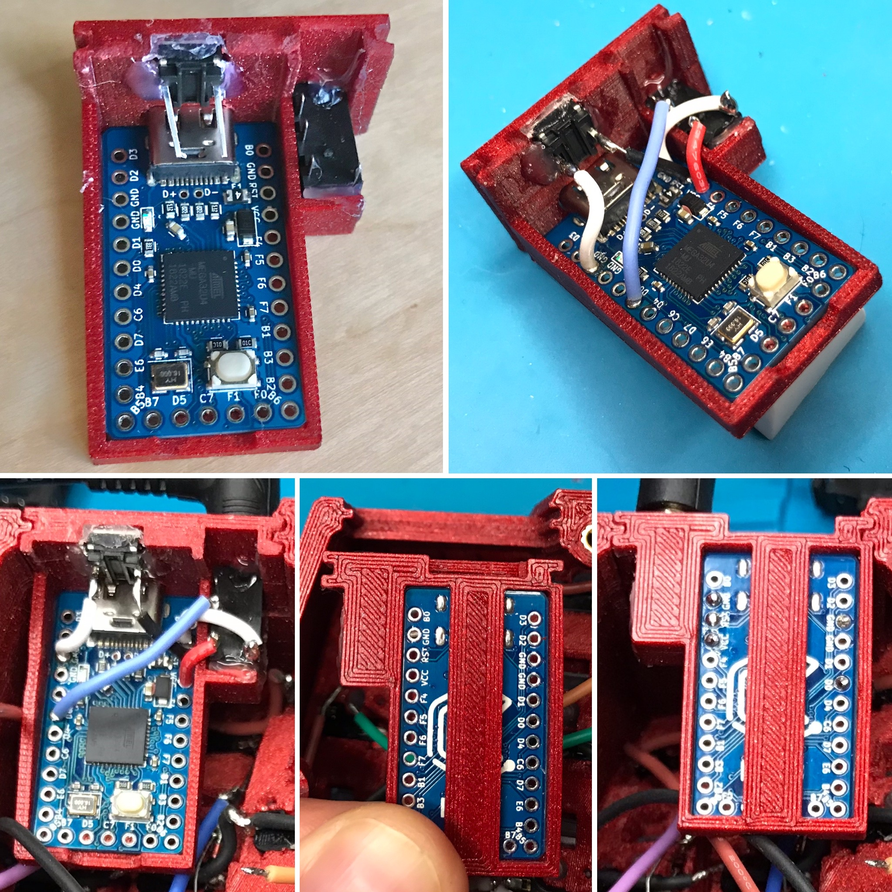

## Wiring
- Uses typical COL2ROW diode direction and pins for dactyl manuform
- Should be backwards compatible with dactyl-manuform 5x6 firmware from
	- https://config.qmk.fm/#/handwired/dactyl_manuform/5x6/LAYOUT_5x6
	- https://github.com/Oh-Keycaps/firmwares#how-to-just-download-our-firmware
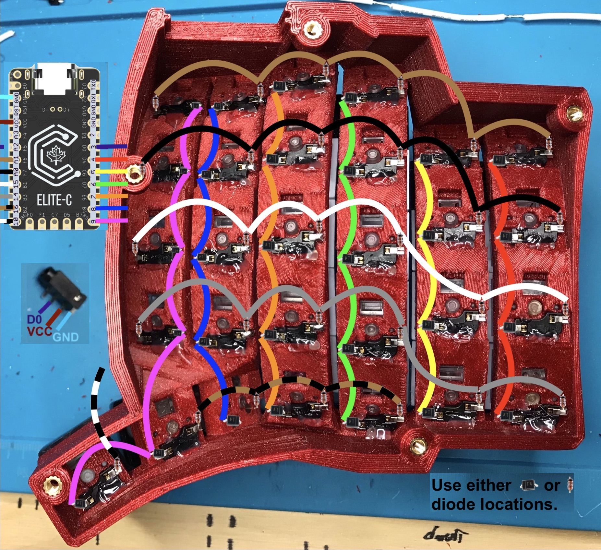
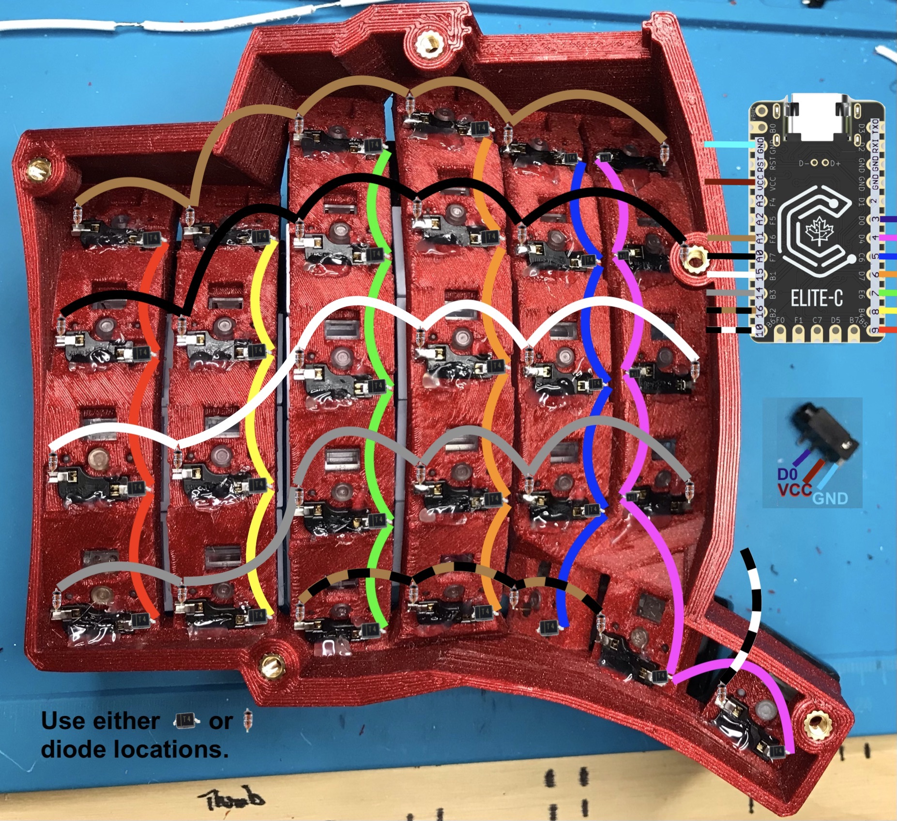

## Tools & Supplies [Full amazon wish list of equipment](https://www.amazon.ca/hz/wishlist/ls/18NL4T59KM4AE?ref_=wl_share)
- Soldering iron & stand, at least 50 watt
- No clean lead free solder in 21awg, or 25awg for smaller SMD components [lead solder is easier to flow, but be careful](https://www.wellpcb.com/lead-free-solder-vs-lead-solder.html)
- Silicone covered 26awg (0.405mm) wire
- Long tip gluegun, at least 60 watt

## Comparison with original Tightyl
- Orig. Tightyl (white) had more row curvature, and wider spaceing between columns
- New Compactyl (blue) uses a flatter row curvature, but increases tent to result in similar keyboard angle
- New Compactyl (blue) is approximately 4mm taller (plus additional heigh for bottom plate if used) because of space requried by hot swap holders below pinky columns.
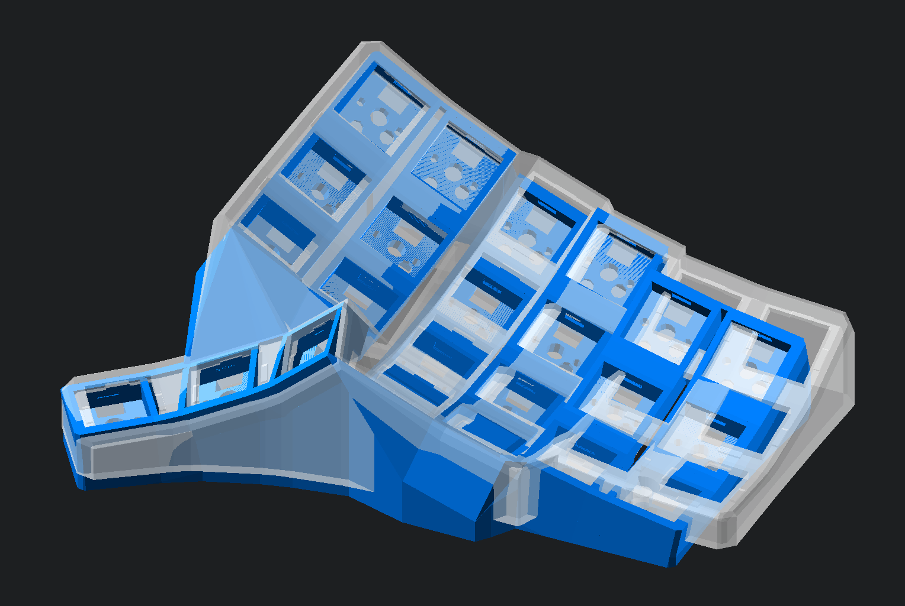

## Generate OpenSCAD and STL models

**Setting up the Clojure environment**
* [Install the Clojure runtime](https://clojure.org)
* [Install the Leiningen project manager](http://leiningen.org/)
* [Install OpenSCAD](http://www.openscad.org/)

### Generating a Design
* Run `lein auto generate`
* This will regenerate the `things/*.scad` files whenever the .clr file is saved
* Use OpenSCAD to open a `.scad` file.
* Make changes to design in `src/dactyl_keyboard/dactyl.clj`, open scad files will auto regenerate, OpenSCAD will rerender.
* When done, use OpenSCAD to render, then export model STL files which can be printed by 3d printer slicing software.

### Batch (parallel) Processing
* Edit the path for OpenSCAD in `create-models.sh` if needed
* Change any other settings for which files you want to render
* Wait for STL files to appear (this may take a minute or two) 

## Tips

* I gave up trying to keep good values for both 4x6 and 5x6 options. So when adjusting the number of rows / cols, or tenting angles, (amoung other larger design changes) you will most likely have to update some magic numbers. I recommend opening the test.scad file and manipulate:
	* defn column-curvature 
	* defn centerrow
	* def centercol
	* defn column-offset
	* def keyboard-z-offset
	* def wrist-rest-z-height-adj
	* defn usb-holder-offset-coordinates
	* defn screw-insert-all-shapes
	* defn top-screw-insert-all-shapes
	* other magic numbers, collect them all :D
* When trying things out, 10 seconds of rendering time in OpenSCAD is really annoying. Load one of the test outputs with commented out parts that you aren't changing / don't use.
* If you're not sure what things are generted by a piece of code, color them in using something like
`(->> SOMETHING_HERE (color RED))` (see examples in dactyl.clj).

## License

Copyright © 2015-2022 Matthew Adereth, Tom Short, Leo Lou, Okke Formsma, Derek Nheiley

The source code for generating the models is distributed under the [GNU AFFERO GENERAL PUBLIC LICENSE Version 3](LICENSE).

The generated models are distributed under the [Creative Commons Attribution-ShareAlike 4.0 International (CC BY-SA 4.0)](LICENSE-models).
