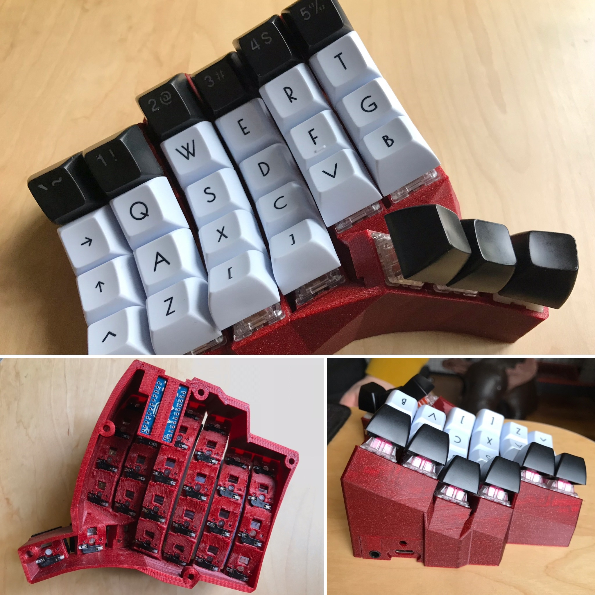
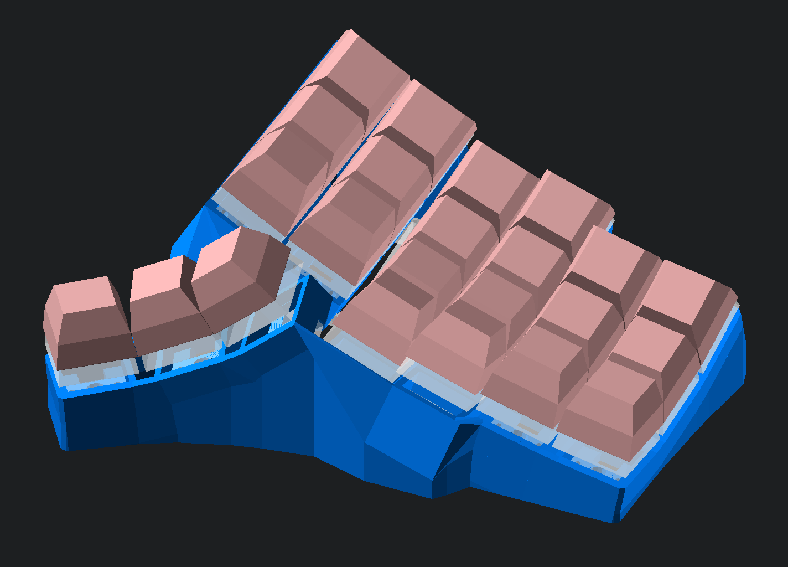
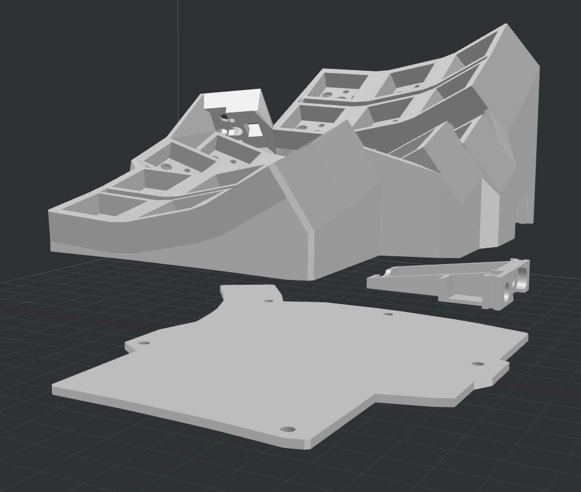
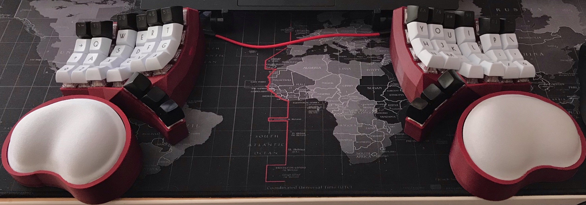
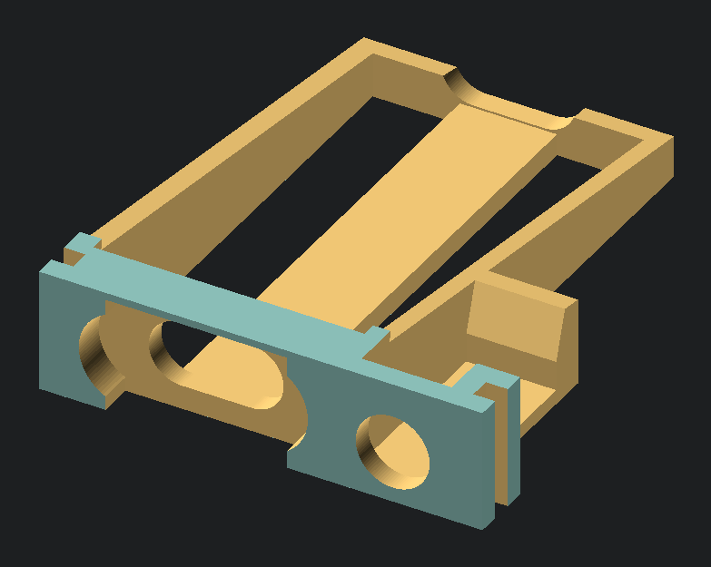

# Compactyl - A Compact Dactyl ManuForm Keyboard

This is a fork of [the okke fork](https://github.com/okke-formsma/dactyl-manuform-tight) of the [l4u fork](https://github.com/l4u/dactyl-manuform-mini-keyboard) of the [tshort fork](https://github.com/tshort/dactyl-keyboard) of the [Dactyl](https://github.com/adereth/dactyl-keyboard), a parameterized, split-hand, concave, columnar, ergonomic keyboard.

## Features
- Hotswap north facing switch plates
- Increase pinky stagger
- Adjusted column spacing for better clearance
- Continuous (vs. recessed) bottom plate with filleted holes
- Exoskeleton top case design
- Rendered both 4x6 and 5x6 versions with bottom plate
- (orig. Tightyl) As small around the keys as possible
- (orig. Tightyl) Smoother transition between thumb and fingers (less facets)
- (orig. Tightyl) Thicker walls in steep regions where walls were too thin

## Update USB holder
- Created ("working" but unpolished) SCAD version of USB holder for modifications
- Provide better clearance to USB cables plugging into controller
- Adjust size to better hold Elite-C controller
- Taper angle to reduce waste material
- Make holder shape symetrical to case notches so it fits upside down or right side up
- Add option for square reset button to be held as well

## Wiring
- Uses typical COL2ROW diode direction and pins for dactyl manuform
- Should be backwards compatible with dactyl-manuform 5x6 firmware from confrom
	- https://config.qmk.fm/#/handwired/dactyl_manuform/5x6/LAYOUT_5x6
	- https://ohkeycaps.com/pages/via-support

## Comparison with previous model
- Orig. Tightyl (white) had more row curvature, and wider spaceing between columns
- New Compactyl (blue) uses a flatter row curvature, but increases tent to result in similar keyboard angle
- New Compactyl (blue) is approximately 4mm taller (plus additional heigh for bottom plate if used) because of space requried by hot swap holders below pinky columns.

## Generate OpenSCAD and STL models

### OLD
* Run `lein repl`
* In the repl run `(load-file "src/dactyl_keyboard/dactyl.clj")`
* This will regenerate the `things/*.scad` files
* Use OpenSCAD to open a `.scad` file.
* Make changes to design, repeat `load-file`, OpenSCAD will watch for changes and rerender.
* When done, use OpenSCAD to render, then export model STL files which can be printed by 3d printer slicing software.

### NEW
* Run `lein auto generate`
* This will regenerate the `things/*.scad` files whenever the .clr file is saved
* Use OpenSCAD to open a `.scad` file.
* Make changes to design in `src/dactyl_keyboard/dactyl.clj`, open scad files will auto regenerate, OpenSCAD will rerender.
* When done, use OpenSCAD to render, then export model STL files which can be printed by 3d printer slicing software.

### Batch (parallel) Processing
* Edit the path for OpenSCAD in `create-models.sh` if needed
* Change any other settings for which files you want to render
* Wait for STL files to appear (this may take a minute or two) 

## Tips

* When trying things out, 10 seconds of rendering time in OpenSCAD is really annoying. Load one of the test outputs with commented out parts that you don't use.
* If you're not sure what things are generted by a piece of code, color them in using something like
`(->> SOMETHING_HERE (color RED))` (see examples in dactyl.clj).

## License

Copyright © 2015-2020 Matthew Adereth, Tom Short, Leo Lou, Okke Formsma, Derek Nheiley

The source code for generating the models is distributed under the [GNU AFFERO GENERAL PUBLIC LICENSE Version 3](LICENSE).

The generated models are distributed under the [Creative Commons Attribution-ShareAlike 4.0 International (CC BY-SA 4.0)](LICENSE-models).
